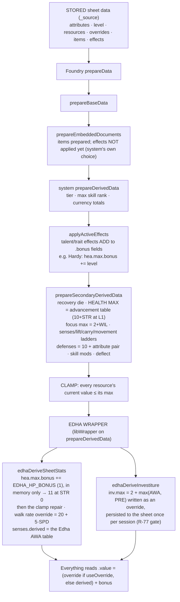

# How every stat on an Edha character is calculated

Written 2026-09-06 for ruling **R-54** ("is 11 max health at STR 0 intended?"), at Ben's request:
*"return an instruction set/flowchart that shows how each stat is calculated on the actors."*
Everything below was read from source, not from memory: the cosmere-rpg system at **release-2.1.0**
(`src/system/documents/actor.ts`, `src/system/data/actor/{common,character}.ts`,
`src/system/utils/advancement.ts`, `src/system/config.ts`), the engine
(`module-src/scripts/register-skills.js`, the `THE EDHA DERIVED-STAT RULES` block ~L17289 and
`edhaDeriveSheetStats` ~L17314), and the two canon sources the engine itself cites:
`source-materials/legacy-uploads/Character_Building_Rules.md` §Derived stats and
`source-materials/legacy-uploads/Edha_Character_Builder.xlsx` (the Builder Reference sheet).

## 1. The answer to R-54 in one paragraph

**Canon says a level-1 character has 10 + STR health. So does the system. The +1 is not a rule
anywhere; it is `EDHA_HP_BONUS = 1` in the engine, inherited from a per-actor hack on the four June
playtest PCs.** `Character_Building_Rules.md` §HP: "L1 = 10 + STR". The Builder Reference workbook,
cell H22 of *Character Builder*: `=10+STR+(L-1)*5+IF(L>=6,STR-1,0)+IF(L>=11,STR-2,0)+IF(L>=16,STR-3,0)`,
which is 10 + STR at level 1 and 39 + 2·STR at level 7. cosmere-rpg 2.1.0's advancement table
(`config.ts` ~L485): level 1 `health: 10, healthIncludeStrength: true`, levels 2–5 `health: 5`,
level 6 `health: 4` + STR, level 11 `3` + STR, level 16 `2` + STR — **the same table, term for term.**
The engine comment that says "the cosmere system derives all three differently" is true for
Movement and Senses and **false for HP**. A "level gate" would apply the +1 only above level 1,
which matches nothing in canon either. **Recommended: remove the +1 (`EDHA_HP_BONUS = 0`), not gate
it.** One constant; the sheet, the wizard preview, and the pinned tests move together by design.

## 2. The pipeline — what runs, in what order, on every data prepare

Foundry re-runs this whole chain every time an actor's data is prepared (on load, after any update,
after an effect toggles). Nothing in it is stored except what is marked *stored*.

Two facts about this chain explain most past bugs:

- **The system applies Active Effects inside `prepareDerivedData`, after the base derivation,** so
  an effect can read derived numbers. Side effect: a bare second `prepareData()` re-adds every
  ADD-mode effect (bench run 36's 64 ↔ 57 max-HP flip). `reset()` is the restore.
- **The system clamps current resources to their max BEFORE the Edha wrapper runs.** So a max the
  wrapper raises afterwards is a point the clamp already removed. That is why the +1 was
  unreachable for a month (13/14 forever) until fix pass E re-ran the clamp from `_source`.
  If the +1 goes, that repair becomes a no-op by construction.

**Every derived number is a `DerivedValueField`:** `{derived, override, useOverride, bonus}` with a
getter-only `.value = (useOverride ? override : derived) + bonus`. The engine reads these only
through `edhaDerivedNum()`. "Value" is never stored; `derived` is recomputed every prepare;
`override`/`useOverride`/`bonus` are stored on the sheet — and effects add to `bonus` in memory.

## 3. Every stat, side by side

Attribute values below are the sheet's `value` (assigned points). Where the system reads
`value + bonus` it is written as such; note that health, focus, and defenses read the bare value
on purpose (system comment: "Should only be the value, not include the bonus").

| Stat | Edha canon (rules doc + builder workbook) | cosmere-rpg 2.1.0 | Edha engine layer | Talent/trait effects on it (count in `data/`) |
|---|---|---|---|---|
| **Attributes** STR SPD INT WIL AWA PRE | assigned points (12 at L1, +1 at L3, L6, …) | stored `value`; effects add `bonus` | none | `str.bonus` 1, `spd.bonus` 1 (Stitchmother Phase 2) |
| **Max Health** | L1 **10 + STR**; L2–5 +5; L6 4 + STR; L7–10 +5; L11 3 + STR; L12–15 +5; L16 2 + STR; L17–20 +5 (= 39 + 2·STR at L7) | **identical**: `deriveMaxHealth` sums the advancement rules into `hea.max.derived` | **+1** to `hea.max.bonus` in memory every prepare (`EDHA_HP_BONUS`), skipped while the sheet stores a manual bonus; then the clamp repair | `hea.max.bonus` 8 (Hardy ×3 colours: +level; Stitchmother +20; Unbreakable Line; …) |
| **Current Health** | — | clamped to max at the end of secondary derivation (before the +1) | clamp repair hands back the stored point | — |
| **Max Focus** | 2 + WIL | 2 + WIL (value) | none | `foc.max.bonus` 6 (Composed +2, …) |
| **Max Investiture** | 2 + max(AWA, PRE), only if attuned | **not derived for characters** — a manual field | `edhaDeriveInvestiture`: override = 2 + max(AWA, PRE); current clamped; override persisted to the sheet once per session, non-primary GMs defer (R-77) | none |
| **Defenses** PHY / COG / SPI | 10 + STR+SPD / 10 + INT+WIL / 10 + AWA+PRE | **identical** (attribute values) + `bonus` | read-only (`edhaReadDefense`); `edha-defense-buff` applies scene/turn buffs as effects | `defenses.*.bonus`: phy 6, cog 10, spi 12 (Customary Garb, Collected, …) |
| **Movement** (walk) | 20 + 5·SPD ft | ladder `[20,25,30,40,60,80][ceil((SPD+bonus)/2)]` | **override = 20 + 5·SPD** (SPD value), unless the sheet already carries its own override; effect bonuses add on top via the getter | `walk.rate.bonus` 5 (Surefooted +10, Walking Ruin, …), `walk.rate.override` 1 (Siege Form 0) |
| **Senses range** | AWA 0→10, 1→15, 2–3→20, 4→25, 5–6→30 ft | ladder `[5,10,20,50,100,∞][ceil((AWA+bonus)/2)]` | **`.derived` overwritten with the Edha table** (AWA value); a hand-set override still wins; bonus still adds; the token's sight range is set from the same table | none |
| **Recovery die** | WIL 0–1 d4, 2–3 d6, 4–5 d8, 6–7 d10 | `[d4,d6,d8,d10,d12,d20][ceil((WIL+bonus)/2)]` — same to WIL 6; **WIL 7+ gives d12 where canon says d10** | none (wizard preview mirrors the system ladder) | none |
| **Lift / Carry** | not in canon | `[100,200,500,1000,5000,10000]` / `[50,100,250,500,2500,5000]` by ceil((STR+bonus)/2) lb | none | none |
| **Deflect** | — | max(natural, best equipped armour) | none | Guardian Stance +1 Deflect (toggled effect) |
| **Skill modifier** | rank + attribute | rank + (value + bonus) | none | — |
| **Skill-rank budget** | 5 + (L−1)·2 | advancement table (4 at L1) | wizard and sheet budget bar use the Edha number | — |
| **Tier / max skill rank** | table: T1 L1–5 (max 2), T2 L6–10 (3), … | same table | none | — |

Net for a fresh level-1 character with every attribute 0: **Health 11 (engine) vs 10 (canon and
system)**, Focus 2, Investiture 2, defenses 10/10/10, Move 20 ft, Senses 10 ft (system alone would
say 5 ft), Recovery d4.

## 4. Where the +1 came from — the history, dated

1. **2026-05-17** — Ben's reference sheets for the four playtest PCs (level 7).
2. **2026-06-10** — the pregens are built in Foundry "stats sheet-matched (HP/inv/movement)"
   (handoff §8a). To match the sheets' health each actor was given a **hand-set
   `hea.max.bonus: 1`** on its own sheet. *The May-17 sheets are not in the repo, so why they were
   one point above the formula cannot be checked here.*
3. **2026-06-11b** — the V3 engine pass generalizes the per-actor hack into a rule for every
   character: "HP = system + 1", applied in memory, with `edha.migrateDerivations()` to strip the
   stored per-actor bonuses so nothing double-applies.
4. **2026-07-19z** — the creation wizard shows a fresh actor at 10/11 before any pick. The +1 is
   blamed on a phantom transfer effect riding a basic action; transfer effects are stripped from
   action copies. That was not the cause (run 21 later measured zero transfer effects), but the
   strip was harmless.
5. **2026-07-28i** (fix pass E, bench run 21) — root cause found: the engine's own +1, plus the
   clamp-ordering bug that made the extra point unreachable (13/14). Clamp repaired; the constant
   is named `EDHA_HP_BONUS` and shared by sheet, wizard preview and tests; **R-54 filed** asking
   whether 11 is intended.
6. **2026-09-06** (this trace) — both canon sources and the system agree on 10 + STR at level 1.
   The +1 has no source other than step 2.

## 5. What a "level gate" is, and the three options

A **level gate** is a condition on the level: `if (actor.system.level > 1) bonus += 1`, so the +1
applies from level 2 up and a level-1 character reads 10. It is a hack on a hack — canon has no +1
at level 2 either.

| Option | Engine change | Level-1 STR-0 health | Matches canon? | Side effects |
|---|---|---|---|---|
| (a) keep 11 | none | 11 | no | the "+1 max health" checklist row is rewritten to expect 11 |
| (b) level gate | add the condition | 10 (11+ from L2) | no | two formulas to explain; preview and tests carry the gate too |
| **(c) remove the +1** — *recommended* | `EDHA_HP_BONUS = 0` (one constant) | **10** | **yes**, and equals the system | every character's max drops by 1 on the next prepare; a character at full health is clamped by 1; nothing stored changes; the clamp repair becomes a no-op; the June pregens that still store a manual bonus keep it until `edha.migrateDerivations()` runs; the checklist row's original "10/10" target becomes reachable; the engine comment "derives all three differently" is corrected to two |

Whichever Ben picks: the two neighbouring **bugs** stay bugs (the wizard's derived-stat preview
must promise what the sheet will show, and the finish step's top-up must re-read after the
derivation settles) and are fixed independently of this ruling.

## 6. Where to look (for the next agent)

- Engine: `module-src/scripts/register-skills.js` — `EDHA_HP_BONUS` / `edhaWalkRateFtFromSpd`
  (~L17300), `edhaDeriveInvestiture` (~L17254), `edhaDeriveSheetStats` (~L17314), the wrapper
  install in `Hooks.once("ready")` just below it, `edhaSensesRangeFtFromAwa` (~L10068),
  `edhaCwDerivedPreview` (~L8556), `edhaReadDefense` (~L5048), `edhaDerivedNum` (~L5452).
- System (read-only clone, release-2.1.0): `src/system/documents/actor.ts` `prepareDerivedData`
  (~L292: super → `applyActiveEffects` → `prepareSecondaryDerivedData`);
  `src/system/data/actor/common.ts` `prepareSecondaryDerivedData` (~L685) and the four ladders
  beneath it; `src/system/data/actor/character.ts` (~L93, health/focus/recovery);
  `src/system/utils/advancement.ts` `deriveMaxHealth`; `src/system/config.ts` `advancement.rules`.
- Canon: `source-materials/legacy-uploads/Character_Building_Rules.md` §Derived stats, §HP,
  §Recovery Die, §Senses Range; `Edha_Character_Builder.xlsx` → *Character Builder*!H22 and
  *Reference*!G4:H24.
- Tests pinning the shared helpers: `tests/` (grep `EDHA_HP_BONUS`, `edhaSensesRangeFtFromAwa`).
